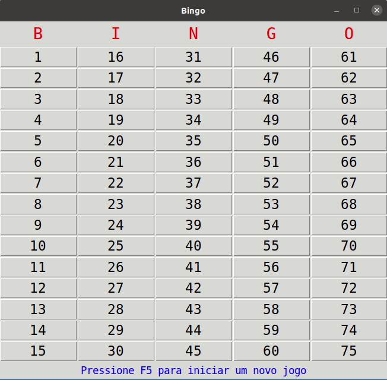
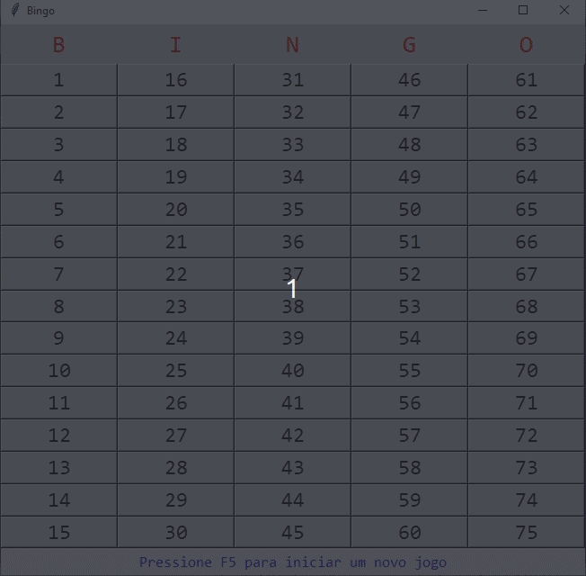

# Bingo
App desktop para acompanhamento de bingo em Python

---
#### Para executar:
***Linux***
```sh
$ sudo apt-get install python3-tk
$ git clone https://github.com/alan-nardin/Bingo.git
$ cd Bingo
$ python3 app.py
```
***Windows***
```sh
C:\Projetos> git clone https://github.com/alan-nardin/Bingo.git
C:\Projetos> cd Bingo
C:\Projetos> python app.py
```

---
### Sceenshots:
***Linux***



***Windows***

